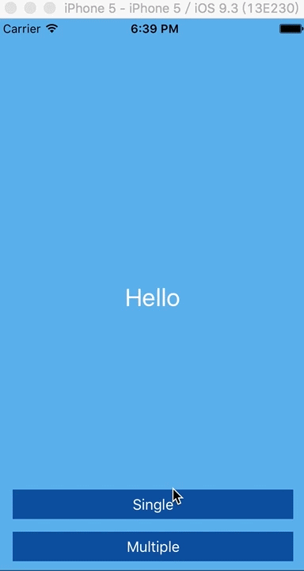
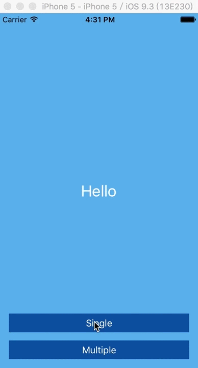

## JNSelectView


[](http://mit-license.org)

JNSelectView is simple SelectView component for iOS (Obj-C)<br/>

######multiple select

######single select



## Usage
Just drag the folder 'SelectView' into your project.
###### single select
```objective-c
[JNSelectView presentSingleSelectViewWithList:aryDataList
                                        title:@"title"
                            completionHandler:^(NSInteger index)
{
    NSLog(@"Select Index: %d",index);
}];

```
###### multiple select
```objective-c
[JNSelectView presentMultipleSelectViewWithList:aryDataList
                                          title:@"title"
                              completionHandler:^(NSArray *aryList) {
    NSLog(@"Selected Indexes @[NSNumber] : %@",aryDataList);
}];

```
###### multiple select (max pick & minimum pick & Remain previous)
```objective-c
// self.m_arSelected first should be nil,
// point to aryList when completionHandler be called.

[JNSelectView presentMultipleSelectViewWithList:aryDataList
                                   selectedList:self.m_arySelected
                                          title:@"title"
                                        maxPick:4
                                    minimumPick:1
                              completionHandler:^(NSArray *aryList)
 {
     self.m_arySelected = aryList;
     NSLog(@"Selected Indexes @[NSNumber] : %@",aryDataList);
 }

```

## Feature
* Easy to use, using method with completionHandler!
* Available for all size (iPhone / iPad)
* Multiple select / Single select
* Configurate max pick and minimum pick(option)
* Remain Previous selected indexes.(option)

## License

JNSelectView is available under the MIT license. See the LICENSE file for more info.
